# Governed QA Forge

Governed QA Forge is a dataset compiler for synthetic question/answer corpora. It generates candidates, verifies and decontaminates them, records human review, and emits reproducible fine-tuning releases with row-level lineage.

It also provides a split-plane service for blind agent workers: the worker API receives only a
self-contained question and never sees sources, reference answers, verifier contracts, scores, or
review outcomes. A private control API finalizes collected answers through the same governed gates.

It is deliberately not a prompt-to-JSONL script. A row cannot enter a release unless its source,
teacher, and behavior anchors are authorized; its family split is frozen; its final answer passes an
independent verifier; its structured derivation is explicitly reviewed; its overlap checks pass;
and an explicit review decision exists.

## What it produces

Each release contains:

- `train.jsonl`, `validation.jsonl`, and `test.jsonl` as messages-only conversational JSONL;
- matching `*.metadata.jsonl` provenance sidecars that are not model input;
- a manifest with counts, policies, input hashes, and per-file SHA-256 values;
- a dataset card/datasheet;
- [Croissant](https://docs.mlcommons.org/croissant/) JSON-LD metadata;
- [W3C PROV](https://www.w3.org/TR/prov-o/) JSON-LD lineage;
- a rejection ledger and `SHA256SUMS`.

## Pipeline

```mermaid
flowchart LR
  A[Authorized sources and teachers] --> B[Reviewed seed bank]
  B --> C[Lineage split assignment]
  C --> D[3-10x candidate generation]
  D --> E[Schema and policy validation]
  E --> F[Independent answer verification]
  F --> G[Exact, semantic, lineage, benchmark checks]
  G --> H[Coverage-aware selection]
  H --> I[Human review]
  I --> J[Immutable release builder]
```



## Quick start

```bash
git clone https://github.com/robit-man/governed-qa-forge.git
cd governed-qa-forge
python -m venv .venv
. .venv/bin/activate
pip install -e '.[dev]'

# Complete offline journey: scaffold fixture workspace, generate, review,
# release, and verify the evidence bundle.
qaforge demo demo-workspace

# Inspect the result.
qaforge status demo-workspace
qaforge verify-release demo-workspace 0.1.0 --allow-unanchored
```

The demo uses an explicitly marked deterministic fixture teacher. It never calls a model and its review decisions are marked `demo-fixture`; production runs cannot mistake it for an external human review.

## Real teacher workflow

```bash
qaforge init corpus-workspace

# Edit configuration, taxonomy, seed bank, and registries. In particular,
# approve the exact provider/model, reviewer roster, source permissions,
# and dated terms snapshot. Production scaffolds target 30,000 selected records so the
# fixed per-split minimum has operational headroom.
export QAFORGE_TEACHER_API_KEY='...'
qaforge doctor corpus-workspace
qaforge generate corpus-workspace --provider teacher-main

# Review selected.jsonl, then record decisions.
qaforge review-export corpus-workspace RUN_ID corpus-workspace/review.jsonl
qaforge review-import corpus-workspace RUN_ID corpus-workspace/review.jsonl
qaforge release corpus-workspace RUN_ID
# Publish the printed anchor through a separately trusted channel, then verify with:
qaforge verify-release corpus-workspace 0.1.0 --expected-sha256 PUBLISHED_ANCHOR
```

OpenAI-compatible endpoints—including compatible local servers—are configured through `registry/teachers.yaml`. Credentials are named by environment variable and are never written into run artifacts.

## Core guarantees

- **Fail closed:** unclear, blocked, expired, or incompatible authorization stops the run.
- **Split before generation:** every descendant stays in its lineage family’s split.
- **Semantically bound verification:** built-in providers answer an unchanged seed task wrapped only
  by an allowlisted meaning-preserving transform; exact, numeric, bounded-regex, JSON, and
  citation-contract verifiers then evaluate the answer independently.
- **Layered decontamination:** canonical hashes, token shingles, deterministic semantic fingerprints, lineage checks, and protected benchmarks.
- **No judge theater:** model output is never its own release authority; review remains explicit.
- **Anchored evidence:** runs and releases cannot be silently overwritten, and release verification
  requires a separately retained root digest unless local demo mode is explicitly requested.
- **Portable metadata:** datasheet, Croissant, PROV, rejection ledger, and file fixity ship together.
- **One production minimum:** release is impossible below 20,000 train, 2,000 validation, and
  2,000 test rows, ten categories, all three difficulty tiers, and all ten required latent AIWG
  behavior domains.
- **Latent behavior anchors:** scenario/decision/derivation examples enact AIWG-informed
  requirements, evidence, provenance, security, verification, testing, architecture, operations,
  context-boundary, and orchestration behaviors without naming the framework in training messages;
  canonical source hashes and reviewer semantic-alignment attestations prevent tag-only coverage.
- **No convergence by assertion:** every bundle includes a required three-seed, unchanged-base
  comparison protocol; a release gate proves corpus eligibility, not improved intelligence.

## Repository map

```text
src/qaforge/       library and CLI
tests/             unit, integration, and end-to-end tests
examples/          documented fixture inputs
docs/              schema, governance, provider, and operational guides
.aiwg/research/    inducted evidence, findings, and audit (source PDFs excluded)
```

## Important boundaries

Governed QA Forge does not determine whether a source or provider is legally usable. It makes
authorization review explicit and auditable. The built-in remote provider intentionally generates
answers, not arbitrary question rewrites: high-volume semantic question evolution requires a
domain-specific solver, pinned-source entailment checker, or independently calibrated rubric
adapter. It also does not safely execute arbitrary generated code; add executable verifiers only
behind an isolation boundary appropriate to your environment.

See [the governance guide](docs/governance.md), [record schema](docs/schema.md), and [security policy](SECURITY.md).
For framework-neutral worker integration and systemd deployment, see the
[opaque service guide](docs/opaque-service.md).

## 1,000-record calibration

The calibration command creates a new workspace, submits 3,000 candidate answers through the
blind worker contract, and selects 1,000 verified lineages. It intentionally stops at independent
review and is machine-classified as permanently non-releasable technical evidence:

```bash
qaforge calibration-pilot pilot-workspace --size 1000 \
  --run-id opaque-calibration-1000
```

## Development

```bash
uv sync --extra dev
uv run ruff format --check src tests
uv run ruff check src tests
uv run mypy src
uv run pytest --cov=qaforge --cov-report=term-missing
uv build
```

## License

MIT
